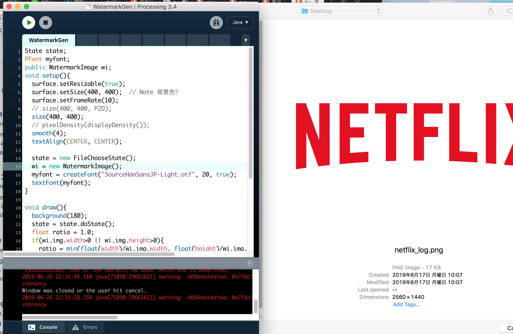
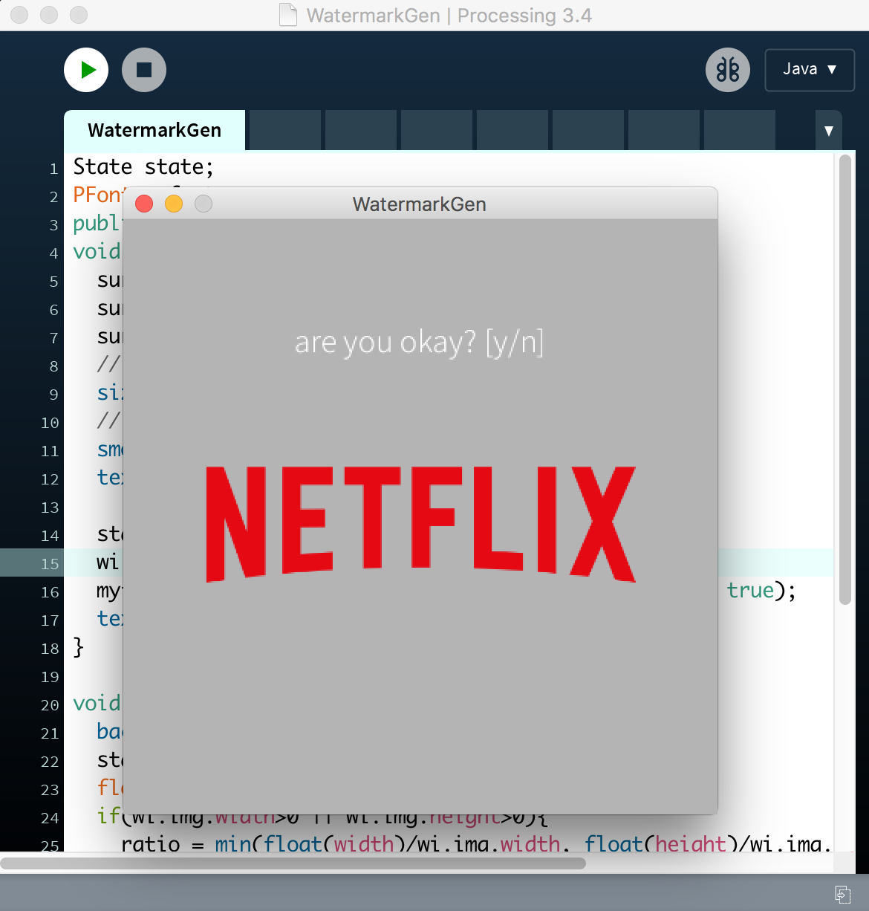
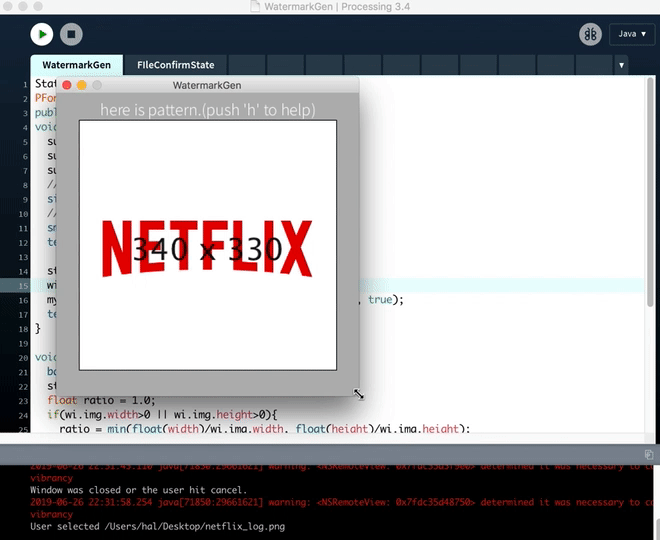
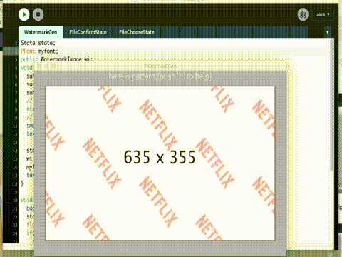

## whats this?
make watermark image file. made by [processing](https://processing.org/).

this is a rapidly and extremely work, only for private, so supersuper fuckin dirty code design.

## useage

### 1st
choose layer image phase. respect for transparent `.png` (but can apply `.jpg`, `.gif` and `.tiff` too).

### 2nd
y/n

### 3rd
addapt. (push `h` to help view on/off)

### 4th
go.
